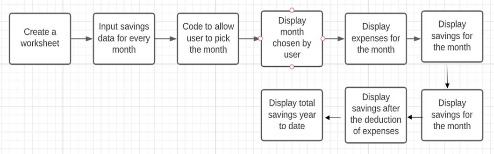
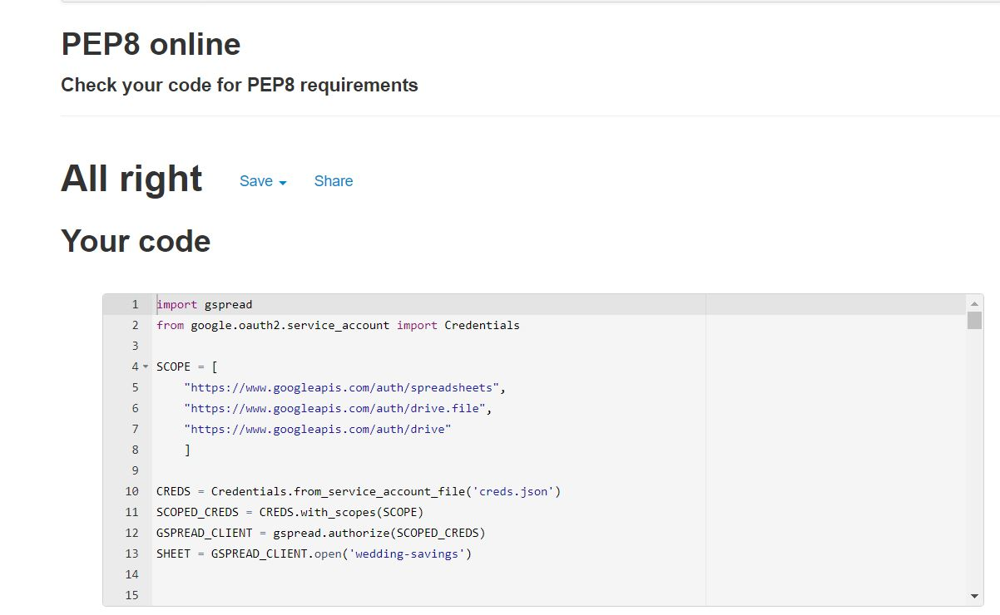

<h1>Wedding Savings Calculator</h1>

View the live project here: [Wedding Savings](https://wedding-savings.herokuapp.com/)

 

<h2>Introduction</h2>
With this Wedding Savings calculator, users can quickly and effortlessly view savings, expenses & total savings both on a per-month and overall basis. Users input the month number corresponding to the month they wish to view, and are returned month expenses, savings, and overall savings including preceding months less expenses.

 

<h2>Built with</h2>

- Python

 

<h2>Timeline</h2>

- This project began with generating the concept of the wedding savings planned, and determining the information relevant (and priority thereof) for users of this product - i.e. savings, expenses, total savings at a certain month. 

- Once the relevant information for users had been determined, I developed a technical approach that would allow this information to be retrieved, and calculated where necessary, based on existing spreadsheet input. 

 

<h2>User Experience (UX)</h2>
The Wedding Savings calculator is primarily designed for ease of understanding and usage. 
 
After selecting the single CTA, ‘Run Program’, Users are given clear instructions upon arrival to enter the month number corresponding to the month they wish to view. 
 
In order to validate their expected month, the month name is returned first, followed by the expenses. Following this, both per-month, savings after expenses and total savings are presented. This is so as similar information (for example, savings’ and expenses’) is grouped together for readability. 

 

<h2>Design</h2>

- Colour Scheme

Not applicable

- Typography

No font was chosen for this programme.

- Imagery

No imagery exists within the programme.

<h2>Features</h2>

- Clearly articulated usage instructions.

- Returns per-month expenses, savings, and savings after expenses.

- Returns current and previous months’ savings totalled, less expenses based on month input. 

 

<h2>Technologies Used</h2>

- Heroku

- Google Sheets

- GitPod

 

<h2>Frameworks, Libraries and Programs Used</h2>

- Google Cloud Platform

- Git

GIT was used for version control and utilising the Gitpod terminal to commit to Git and push to Github.

- GitHub

Github is used to store the projects code after being pushed from Git.

- Lucidchart

Lucidchart was used to create my wireframes at the start of the project.

- Slack Channel

Slack was used to communicate with other coders, and tutors to resolve issues which I was facing with the project.

- Heroku

Heroku was used to deploy the project.

 

<h2>Testings</h2>
The PEP8 Validator was used to validate the code of the project to ensure there were no errors in the project.

[PEP Online Validator-](http://pep8online.com/)

 

Result : "All Right"

In addition to that, I was also using the console to ensure that there were no errors in the whole duration of the project.

 

<h2>Accessibility</h2>
The project can be accessed using Heroku.

 

<h2>Bugs</h2>
There were no known bugs at the time of final deployment.

 

<h2>Issues Faced during the project</h2>

- Trying to assertain the cause of failure regarding data being fetched from Google sheet.

- Understanding the deployment of project to Heroku

 

<h2>Credits and references</h2>

- https://www.flake8rules.com/
- https://www.geeksforgeeks.org/
- https://realpython.com/python-operators-expressions/
- https://medium.com/analytics-vidhya/how-to-read-and-write-data-to-google-spreadsheet-using-python-ebf54d51a72c
- https://www.twilio.com/blog/2017/02/an-easy-way-to-read-and-write-to-a-google-spreadsheet-in-python.html
- Code Institute learning materials

<h2>Deployment</h2>
The project has been developed using Gitpod and Heroku. The project was regularly commited to Gitpod during the initial development phase.

The site was deployed to Heroku.

The steps to deploy are as follows:
First I created an account with the Heroku, then I navigated to "create a new app". I then gave my project a name and clicked create app.
I configured my enviroment variables and the heroku built my app using Github repository. I had then connected my credentials from the .gitignore file to the API. After that, I inserted the contents of my creds.json file to Heroku so that it can accsess my spreadsheet, then I added my buildpack which is Python and Node.js so that it can handle the mock terminal. Later on, I choose my deployment method which is with Github and connected to it by seraching the name of my project. Finally, I manually deployed my project in the mock terminal.
The mock terminal is ready to be used at https://wedding-savings.herokuapp.com/

<h2>Project walkthrough</h2>

Wedding Savings calculator is to enable users to quickly and effortlessly view savings, expenses & total savings both on a per-month and overall basis by just selecting the specific month.

<h2>Contact details</h2>

* Vannesha Andrew - vannesha90@gmail.com
